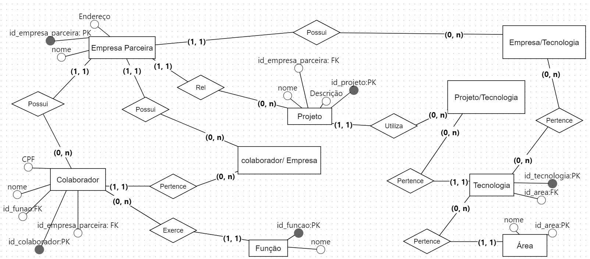
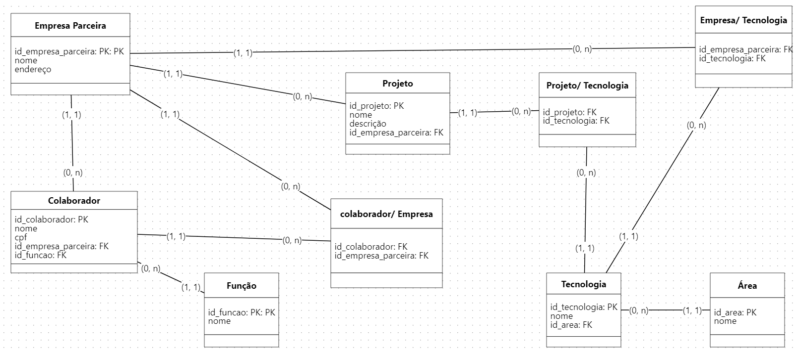

# Projeto de Desenvolvimento de Banco de Dados

## Objetivo

Este projeto visa desenvolver um banco de dados que armazenará informações importantes para o sistema 'Resilientes'. O banco de dados será utilizado para avaliar as tecnologias adotadas pelas empresas e identificar seus colaboradores.

## Como Usar

### Configuração do Banco de Dados:

1. Execute no [MySQL Workbench](https://www.mysql.com/products/workbench/) o script [`create_database`](./Scripts/create_database.sql) para criar o banco de dados e as tabelas necessárias.

### Povoar o Banco de Dados:

1. Utilize no [MySQL Workbench](https://www.mysql.com/products/workbench/) o script [`insert_database`](./Scripts/insert_database.sql) para inserir os dados no banco de dados.

## Modelo Conceitual e Lógico do Banco de Dados

Veja abaixo os modelos conceitual e lógico que representam a estrutura do banco de dados.

- **Modelo Conceitual**
  
- **Modelo Lógico**
  

## Respostas aos requisitos do projeto
Acesse o arquivo [RESPOSTAS](./RESPOSTAS.md).

## Programas Utilizados

- [MySQL Workbench 8.0 CE](https://www.mysql.com/products/workbench/)
- [XAMPP](https://www.apachefriends.org/index.html)

## Autor
Debora Jansen
